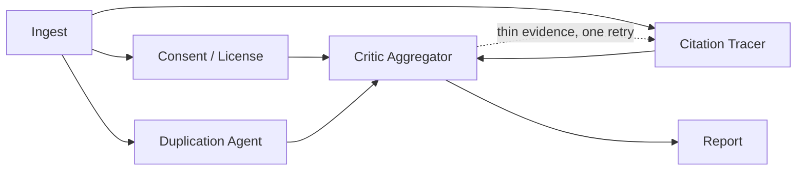

# DataSentinel — Dataset Provenance Watchdog

Paste a Kaggle or Hugging Face dataset URL. A multi-agent pipeline checks its
license, consent signals, citing papers (with retraction checks), duplication
markers, and profiles the **actual data**, then gives you a 0–100 trust score
with an evidence-backed report.

🔗 **Live demo:** [dataasentinal.onrender.com](https://dataasentinal.onrender.com)

## What it checks

- **Ingest** — scrapes Kaggle/HF page metadata (title, license, tags, files, columns)
- **Real data profiling** — downloads sample rows, computes missing %, duplicates, class imbalance, PII-shaped columns
- **Consent & license agent** — flags missing/vague licenses, consent language
- **Citation tracer** — finds citing papers (OpenAlex), checks retractions (Crossref)
- **Duplication agent** — flags copy-paste descriptions, re-upload patterns
- **Critic aggregator** — deterministic score + LLM-written rationale (LLM never sets the number)

## Pipeline



## CI gate

```bash
curl -X POST localhost:8000/audit -d '{"url": "...", "fail_under": 60}'
curl localhost:8000/audit/<run_id>/verdict
# { "passed": true, "exit_code": 0 }
```

## Stack

FastAPI · LangGraph · NVIDIA Nemotron LLM · SSE · SQLite · React · Tailwind

## Quick start

```bash
# backend
python3 -m venv myenv && source myenv/bin/activate
pip install -r requirements.txt
cp .env.example .env   # add NVIDIA_API_KEY, optional KAGGLE_API_TOKEN
uvicorn backend.main:app --port 8000 --reload

# frontend
cd frontend && npm install && npm run dev
```

Open the app, paste a `kaggle.com/datasets/*` or `huggingface.co/datasets/*` URL, run audit.

Or skip the setup and just try the [live demo](https://dataasentinal.onrender.com).

## API

| Method | Path | Purpose |
|---|---|---|
| POST | `/audit` | Start audit → `{run_id}` |
| GET | `/audit/{id}/stream` | Live SSE progress |
| GET | `/audit/{id}/report` | Full report |
| GET | `/audit/{id}/verdict` | CI pass/fail |
| GET | `/runs` | Run history |

## Known limits

- Kaggle profiling capped at ~8 MB / 100 rows, needs API credentials
- Paper searches use the free OpenAlex API (no key). Set `OPENALEX_MAILTO` in `.env`
  to your email for the high-rate polite pool; without it the anonymous pool is
  ~100 requests/day, which is plenty for casual use
- Retraction checks depend on Crossref coverage
- Single-process in-memory registry (SQLite persists reports)

---
Built by [m-rishab](https://github.com/m-rishab) · LangGraph + NVIDIA Nemotron
